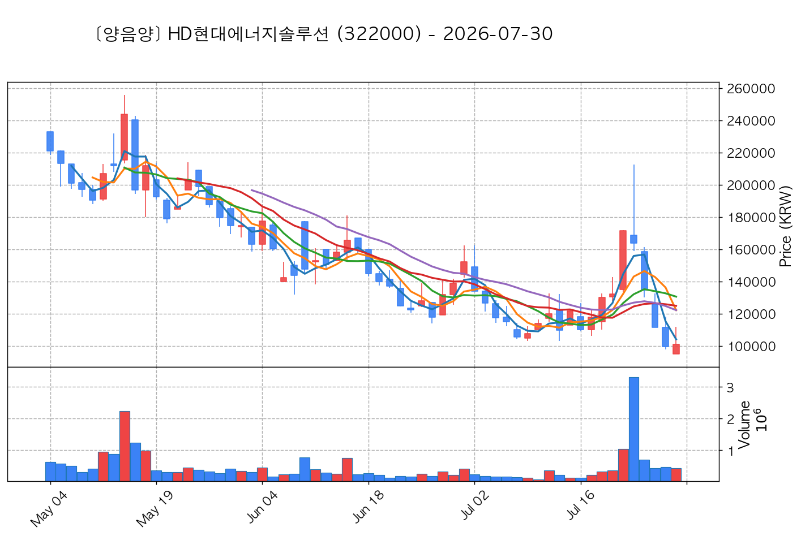

# 📈 [실전플랜 1] 2026-10-02 매매 후보 스크리닝 보고서

> 스크리닝 기준일: 2026-10-02 | [📊 익일 매매 성과 피드백 보고서 보기](./2026-10-02_피드백.html)

---

## 📊 1. 스크리닝 성과 요약

| 전략 | 주요 기법 | 종목수(TOP) |
| :--- | :--- | :---: |
| **전략 1** | 양음양 눌림목 & 사윗감 | 12개 (TOP 3개) |
| **전략 2** | 매집봉 & 이일홍 | 11개 (TOP 1개) |
| **전략 3** | 수급 & 핥 | 0개 (TOP 0개) |
| **합계** | **3대 핵심 전략 통합** | **23개 (TOP 4개)** |

---

## 🔵 3. 전략 1 — 양-음-양 눌림목 (3% × 3슬롯)

### 📋 전략 1 요약표 (상위 10개)

| 종목명 | 기준일종가 | 기준봉 | 지지선 | 비고 및 선정 상태 |
| :--- | ---: | :--- | :---: | :--- |
| **삼미금속** (012210) | 11,960원 | +20.4% 장대양봉 | 3일선 | **★ TOP 1 선택** |
| **레메디** (387690) | 18,870원 | +26.2% 장대양봉 | 3일선 | **★ TOP 2 선택** |
| **티엘비** (356860) | 47,850원 | +16.0% 장대양봉 | 3일선 | **★ TOP 3 선택** |
| **동국생명과학** (303810) | 2,820원 | +19.9% 장대양봉 | 3일선 | 후보군 (1위) |
| **현대바이오랜드** (052260) | 5,030원 | +25.0% 장대양봉 | 5일선 | 후보군 (2위) (사윗감) |
| **금강철강** (053260) | 7,180원 | +23.8% 장대양봉 | 5일선 | 후보군 (3위) (사윗감) |
| **한국비엔씨** (256840) | 3,165원 | +29.2% 장대양봉 | 3일선 | 후보군 (4위) (사윗감) |
| **아이씨티케이** (456010) | 24,900원 | +15.1% 장대양봉 | 5일선 | 후보군 (5위) |
| **노타** (486990) | 20,300원 | +28.9% 장대양봉 | 3일선 | 후보군 (6위) (사윗감) |
| **테라뷰** (950250) | 4,090원 | 상한가 | 3일선 | 후보군 (7위) (사윗감) |

---

### 🔍 전략 1 상세 분석

#### 1) 삼미금속 (012210) — ★ TOP 1 선택

- **기준 종가**: 11,960원 | **거래대금**: 116억
- **분석 사유**: 🚨[매물대 저항] [쌍바닥참고] 과거 2026-09-22 기준봉 후 현재 3일선 지지

#### 2) 레메디 (387690) — ★ TOP 2 선택

- **기준 종가**: 18,870원 | **거래대금**: 80억
- **분석 사유**: 과거 2026-09-28 기준봉 후 현재 3일선 지지

#### 3) 티엘비 (356860) — ★ TOP 3 선택

- **기준 종가**: 47,850원 | **거래대금**: 293억
- **분석 사유**: 과거 2026-09-22 기준봉 후 현재 3일선 지지

#### 4) 동국생명과학 (303810) — 후보군 (1위)

- **기준 종가**: 2,820원 | **거래대금**: 41억
- **분석 사유**: 🚨[매물대 저항] 과거 2026-09-28 기준봉 후 현재 3일선 지지

#### 5) 현대바이오랜드 (052260) — 후보군 (2위) (사윗감)

- **기준 종가**: 5,030원 | **거래대금**: 67억
- **분석 사유**: 🚨[매물대 저항] 과거 2026-09-29 기준봉 후 현재 5일선 지지

#### 6) 금강철강 (053260) — 후보군 (3위) (사윗감)

- **기준 종가**: 7,180원 | **거래대금**: 29억
- **분석 사유**: 🚨[매물대 저항] 🔥[20선 이탈 반등] 과거 2026-09-30 기준봉 후 현재 5일선 지지

#### 7) 한국비엔씨 (256840) — 후보군 (4위) (사윗감)

- **기준 종가**: 3,165원 | **거래대금**: 50억
- **분석 사유**: 과거 2026-09-28 기준봉 후 현재 3일선 지지

#### 8) 아이씨티케이 (456010) — 후보군 (5위)

- **기준 종가**: 24,900원 | **거래대금**: 231억
- **분석 사유**: 과거 2026-09-28 기준봉 후 현재 5일선 지지

#### 9) 노타 (486990) — 후보군 (6위) (사윗감)

- **기준 종가**: 20,300원 | **거래대금**: 33억
- **분석 사유**: 과거 2026-09-22 기준봉 후 현재 3일선 지지

#### 10) 테라뷰 (950250) — 후보군 (7위) (사윗감)

- **기준 종가**: 4,090원 | **거래대금**: 40억
- **분석 사유**: 과거 2026-09-29 기준봉 후 현재 3일선 지지

## 🟡 4. 전략 2 — 일일봉 매집봉 (10% × 1슬롯)

### 📋 전략 2 요약표 (상위 10개)

| 종목명 | 기준일종가 | 기준봉 | 지지선 | 비고 및 선정 상태 |
| :--- | ---: | :--- | :---: | :--- |
| **HD현대에너지솔루션** (322000) | 139,700원 | ★ [1순위 키움정석] 40일 최고가 근접 + 60일선 상승 + 시가대비 +6.3% 속양봉 | 240일선 | **★ TOP 1 선택** |
| **한국파마** (032300) | 8,550원 | ★ [1순위 키움정석] 40일 최고가 근접 + 60일선 상승 + 시가대비 +14.0% 속양봉 | 240일선 | 후보군 (1위) |
| **와이어블** (065530) | 1,484원 | ★ [1순위 키움정석] 40일 최고가 근접 + 60일선 상승 + 시가대비 +17.1% 속양봉 | 240일선 | 후보군 (2위) |
| **이루온** (065440) | 1,619원 | ★ [1순위 키움정석] 40일 최고가 근접 + 60일선 상승 + 시가대비 +14.8% 속양봉 | 240일선 | 후보군 (3위) |
| **피제이전자** (006140) | 5,690원 | ★ [1순위 키움정석] 40일 최고가 근접 + 60일선 상승 + 시가대비 +29.6% 속양봉 | 240일선 | 후보군 (4위) |
| **동서** (026960) | 27,700원 | ★ [1순위 키움정석] 40일 최고가 근접 + 60일선 상승 + 시가대비 +6.1% 속양봉 | 240일선 | 후보군 (5위) |
| **원익홀딩스** (030530) | 29,250원 | 과거 2026-08-28 매집봉 ➔ 240일선 근접 지지 (+2.96%) | 240일선 | 후보군 (6위) |
| **한전기술** (052690) | 126,900원 | 과거 2026-08-26 매집봉 ➔ 240일선 근접 지지 (+1.23%) | 240일선 | 후보군 (7위) |
| **한화** (000880) | 128,400원 | 과거 2026-08-25 매집봉 ➔ 240일선 근접 지지 (-0.08%) | 240일선 | 후보군 (8위) |
| **HB테크놀러지** (078150) | 2,305원 | 과거 2026-09-08 매집봉 ➔ 240일선 근접 지지 (+1.58%) | 240일선 | 후보군 (9위) |

---

### 🔍 전략 2 상세 분석

#### 1) HD현대에너지솔루션 (322000) — ★ TOP 1 선택

- **기준 종가**: 139,700원 | **거래대금**: 520억
- **분석 사유**: ★ [1순위 키움정석] 40일 최고가 근접 + 60일선 상승 + 시가대비 +6.3% 속양봉

#### 2) 한국파마 (032300) — 후보군 (1위)

- **기준 종가**: 8,550원 | **거래대금**: 164억
- **분석 사유**: ★ [1순위 키움정석] 40일 최고가 근접 + 60일선 상승 + 시가대비 +14.0% 속양봉

#### 3) 와이어블 (065530) — 후보군 (2위)

- **기준 종가**: 1,484원 | **거래대금**: 117억
- **분석 사유**: ★ [1순위 키움정석] 40일 최고가 근접 + 60일선 상승 + 시가대비 +17.1% 속양봉

#### 4) 이루온 (065440) — 후보군 (3위)

- **기준 종가**: 1,619원 | **거래대금**: 117억
- **분석 사유**: ★ [1순위 키움정석] 40일 최고가 근접 + 60일선 상승 + 시가대비 +14.8% 속양봉

#### 5) 피제이전자 (006140) — 후보군 (4위)

- **기준 종가**: 5,690원 | **거래대금**: 95억
- **분석 사유**: ★ [1순위 키움정석] 40일 최고가 근접 + 60일선 상승 + 시가대비 +29.6% 속양봉

#### 6) 동서 (026960) — 후보군 (5위)

- **기준 종가**: 27,700원 | **거래대금**: 61억
- **분석 사유**: ★ [1순위 키움정석] 40일 최고가 근접 + 60일선 상승 + 시가대비 +6.1% 속양봉

#### 7) 원익홀딩스 (030530) — 후보군 (6위)

- **기준 종가**: 29,250원 | **거래대금**: 457억
- **분석 사유**: 과거 2026-08-28 매집봉 ➔ 240일선 근접 지지 (+2.96%)

#### 8) 한전기술 (052690) — 후보군 (7위)

- **기준 종가**: 126,900원 | **거래대금**: 271억
- **분석 사유**: 과거 2026-08-26 매집봉 ➔ 240일선 근접 지지 (+1.23%)

#### 9) 한화 (000880) — 후보군 (8위)

- **기준 종가**: 128,400원 | **거래대금**: 74억
- **분석 사유**: 과거 2026-08-25 매집봉 ➔ 240일선 근접 지지 (-0.08%)

#### 10) HB테크놀러지 (078150) — 후보군 (9위)

- **기준 종가**: 2,305원 | **거래대금**: 44억
- **분석 사유**: 과거 2026-09-08 매집봉 ➔ 240일선 근접 지지 (+1.58%)

## 🟢 5. 전략 3 — 수급 낙폭과대 바닥형 (10% × 2슬롯)

해당 전략 포착 종목 없음

