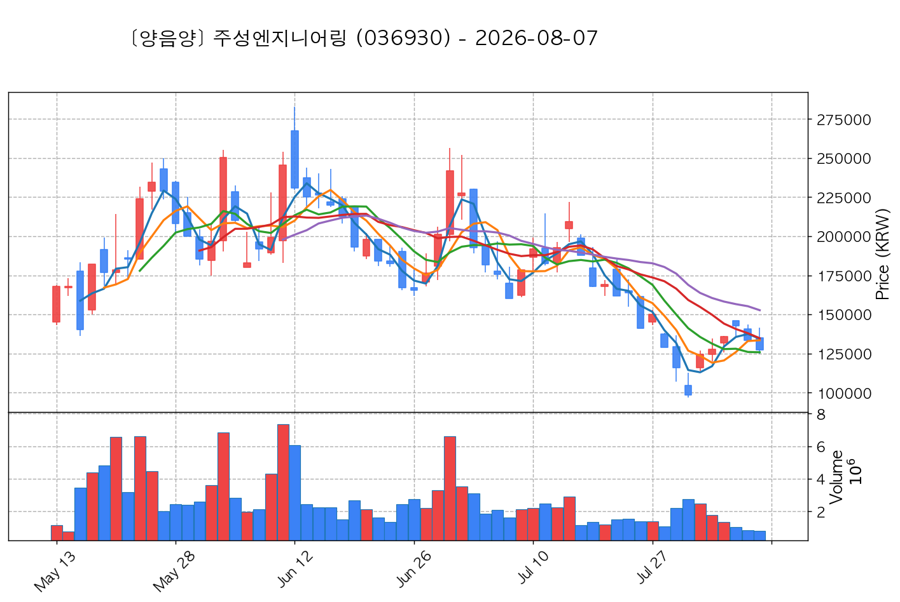

# 📈 [실전플랜 1] 2026-10-07 매매 후보 스크리닝 보고서

> 스크리닝 기준일: 2026-10-07 | [📊 익일 매매 성과 피드백 보고서 보기](./2026-10-07_피드백.html)

---

## 📊 1. 스크리닝 성과 요약

| 전략 | 주요 기법 | 종목수(TOP) |
| :--- | :--- | :---: |
| **전략 1** | 양음양 눌림목 & 사윗감 | 17개 (TOP 3개) |
| **전략 2** | 매집봉 & 이일홍 | 12개 (TOP 1개) |
| **전략 3** | 수급 & 핥 | 1개 (TOP 1개) |
| **합계** | **3대 핵심 전략 통합** | **30개 (TOP 5개)** |

---

## 🔵 3. 전략 1 — 양-음-양 눌림목 (3% × 3슬롯)

### 📋 전략 1 요약표 (상위 10개)

| 종목명 | 기준일종가 | 기준봉 | 지지선 | 비고 및 선정 상태 |
| :--- | ---: | :--- | :---: | :--- |
| **주성엔지니어링** (036930) | 249,500원 | +18.2% 장대양봉 | 5일선 | **★ TOP 1 선택** |
| **한화솔루션** (009830) | 36,300원 | +16.5% 장대양봉 | 3일선 | **★ TOP 2 선택** |
| **레메디** (387690) | 18,730원 | +26.2% 장대양봉 | 3일선 | **★ TOP 3 선택** |
| **나라스페이스테크놀로지** (478340) | 15,590원 | +19.2% 장대양봉 | 5일선 | 후보군 (1위) |
| **동국생명과학** (303810) | 2,765원 | +19.9% 장대양봉 | 3일선 | 후보군 (2위) |
| **티엠씨** (217590) | 18,890원 | 상한가 | 3일선 | 후보군 (3위) |
| **현대바이오랜드** (052260) | 4,930원 | +25.0% 장대양봉 | 3일선 | 후보군 (4위) (사윗감) |
| **삼천당제약** (000250) | 245,500원 | +17.4% 장대양봉 | 3일선 | 후보군 (5위) |
| **롯데에너지머티리얼즈** (020150) | 54,300원 | +19.5% 장대양봉 | 3일선 | 후보군 (6위) |
| **한국비엔씨** (256840) | 3,280원 | +29.2% 장대양봉 | 5일선 | 후보군 (7위) (사윗감) |

---

### 🔍 전략 1 상세 분석

#### 1) 주성엔지니어링 (036930) — ★ TOP 1 선택

- **기준 종가**: 249,500원 | **거래대금**: 4905억
- **분석 사유**: 과거 2026-10-06 기준봉 후 현재 5일선 지지

#### 2) 한화솔루션 (009830) — ★ TOP 2 선택

- **기준 종가**: 36,300원 | **거래대금**: 625억
- **분석 사유**: 과거 2026-09-28 기준봉 후 현재 3일선 지지

#### 3) 레메디 (387690) — ★ TOP 3 선택

- **기준 종가**: 18,730원 | **거래대금**: 122억
- **분석 사유**: 과거 2026-09-28 기준봉 후 현재 3일선 지지

#### 4) 나라스페이스테크놀로지 (478340) — 후보군 (1위)

- **기준 종가**: 15,590원 | **거래대금**: 51억
- **분석 사유**: 과거 2026-10-02 기준봉 후 현재 5일선 지지

#### 5) 동국생명과학 (303810) — 후보군 (2위)

- **기준 종가**: 2,765원 | **거래대금**: 24억
- **분석 사유**: 🚨[매물대 저항] 과거 2026-09-28 기준봉 후 현재 3일선 지지

#### 6) 티엠씨 (217590) — 후보군 (3위)

- **기준 종가**: 18,890원 | **거래대금**: 838억
- **분석 사유**: 과거 2026-10-02 기준봉 후 현재 3일선 지지

#### 7) 현대바이오랜드 (052260) — 후보군 (4위) (사윗감)

- **기준 종가**: 4,930원 | **거래대금**: 24억
- **분석 사유**: 🚨[매물대 저항] 과거 2026-09-29 기준봉 후 현재 3일선 지지

#### 8) 삼천당제약 (000250) — 후보군 (5위)

- **기준 종가**: 245,500원 | **거래대금**: 1035억
- **분석 사유**: 🌪️ [C타입 갭상승털기] 기준봉 익일 갭상승 후 음봉 손바꿈 (기준봉 50% 사수)

#### 9) 롯데에너지머티리얼즈 (020150) — 후보군 (6위)

- **기준 종가**: 54,300원 | **거래대금**: 156억
- **분석 사유**: 과거 2026-10-02 기준봉 후 현재 3일선 지지

#### 10) 한국비엔씨 (256840) — 후보군 (7위) (사윗감)

- **기준 종가**: 3,280원 | **거래대금**: 298억
- **분석 사유**: 과거 2026-09-28 기준봉 후 현재 5일선 지지

## 🟡 4. 전략 2 — 일일봉 매집봉 (10% × 1슬롯)

### 📋 전략 2 요약표 (상위 10개)

| 종목명 | 기준일종가 | 기준봉 | 지지선 | 비고 및 선정 상태 |
| :--- | ---: | :--- | :---: | :--- |
| **대성산업** (128820) | 4,885원 | ★ [1순위 키움정석] 40일 최고가 근접 + 60일선 상승 + 시가대비 +15.1% 속양봉 | 240일선 | **★ TOP 1 선택** |
| **휴마시스** (205470) | 3,155원 | ★ [1순위 키움정석] 40일 최고가 근접 + 60일선 상승 + 시가대비 +18.6% 속양봉 | 240일선 | 후보군 (1위) |
| **종근당바이오** (063160) | 15,030원 | ★ [1순위 키움정석] 40일 최고가 근접 + 60일선 상승 + 시가대비 +7.6% 속양봉 | 240일선 | 후보군 (2위) |
| **글로벌텍스프리** (204620) | 5,800원 | ★ [1순위 키움정석] 40일 최고가 근접 + 60일선 상승 + 시가대비 +7.0% 속양봉 | 240일선 | 후보군 (3위) |
| **HLB제약** (047920) | 12,660원 | 과거 2026-09-21 매집봉 ➔ 240일선 근접 지지 (-0.18%) | 240일선 | 후보군 (4위) |
| **한전기술** (052690) | 128,600원 | 과거 2026-08-26 매집봉 ➔ 240일선 근접 지지 (+2.31%) | 240일선 | 후보군 (5위) |
| **신풍제약** (019170) | 11,210원 | 과거 2026-08-28 매집봉 ➔ 240일선 근접 지지 (-0.14%) | 240일선 | 후보군 (6위) |
| **원익홀딩스** (030530) | 29,150원 | 과거 2026-08-28 매집봉 ➔ 240일선 근접 지지 (+2.36%) | 240일선 | 후보군 (7위) |
| **위메이드맥스** (101730) | 5,360원 | 과거 2026-08-19 매집봉 ➔ 240일선 근접 지지 (+1.08%) | 240일선 | 후보군 (8위) |
| **LS머트리얼즈** (417200) | 15,580원 | 과거 2026-09-16 매집봉 ➔ 240일선 근접 지지 (+0.15%) | 240일선 | 후보군 (9위) |

---

### 🔍 전략 2 상세 분석

#### 1) 대성산업 (128820) — ★ TOP 1 선택

- **기준 종가**: 4,885원 | **거래대금**: 305억
- **분석 사유**: ★ [1순위 키움정석] 40일 최고가 근접 + 60일선 상승 + 시가대비 +15.1% 속양봉

#### 2) 휴마시스 (205470) — 후보군 (1위)

- **기준 종가**: 3,155원 | **거래대금**: 76억
- **분석 사유**: ★ [1순위 키움정석] 40일 최고가 근접 + 60일선 상승 + 시가대비 +18.6% 속양봉

#### 3) 종근당바이오 (063160) — 후보군 (2위)

- **기준 종가**: 15,030원 | **거래대금**: 73억
- **분석 사유**: ★ [1순위 키움정석] 40일 최고가 근접 + 60일선 상승 + 시가대비 +7.6% 속양봉

#### 4) 글로벌텍스프리 (204620) — 후보군 (3위)

- **기준 종가**: 5,800원 | **거래대금**: 48억
- **분석 사유**: ★ [1순위 키움정석] 40일 최고가 근접 + 60일선 상승 + 시가대비 +7.0% 속양봉

#### 5) HLB제약 (047920) — 후보군 (4위)

- **기준 종가**: 12,660원 | **거래대금**: 486억
- **분석 사유**: 과거 2026-09-21 매집봉 ➔ 240일선 근접 지지 (-0.18%)

#### 6) 한전기술 (052690) — 후보군 (5위)

- **기준 종가**: 128,600원 | **거래대금**: 368억
- **분석 사유**: 과거 2026-08-26 매집봉 ➔ 240일선 근접 지지 (+2.31%)

#### 7) 신풍제약 (019170) — 후보군 (6위)

- **기준 종가**: 11,210원 | **거래대금**: 313억
- **분석 사유**: 과거 2026-08-28 매집봉 ➔ 240일선 근접 지지 (-0.14%)

#### 8) 원익홀딩스 (030530) — 후보군 (7위)

- **기준 종가**: 29,150원 | **거래대금**: 194억
- **분석 사유**: 과거 2026-08-28 매집봉 ➔ 240일선 근접 지지 (+2.36%)

#### 9) 위메이드맥스 (101730) — 후보군 (8위)

- **기준 종가**: 5,360원 | **거래대금**: 172억
- **분석 사유**: 과거 2026-08-19 매집봉 ➔ 240일선 근접 지지 (+1.08%)

#### 10) LS머트리얼즈 (417200) — 후보군 (9위)

- **기준 종가**: 15,580원 | **거래대금**: 159억
- **분석 사유**: 과거 2026-09-16 매집봉 ➔ 240일선 근접 지지 (+0.15%)

## 🟢 5. 전략 3 — 수급 낙폭과대 바닥형 (10% × 2슬롯)

### 📋 전략 3 요약표 (상위 1개)

| 종목명 | 기준일종가 | 기준봉 | 지지선 | 비고 및 선정 상태 |
| :--- | ---: | :--- | :---: | :--- |
| **덕산하이메탈** (077360) | 13,860원 | 52주 고점 대비 (65.7%) ➔ 20일 메이저 수급 100억+ 유입 ➔ 없음 지지 안착 | 수급선 | **★ TOP 1 선택** |

---

### 🔍 전략 3 상세 분석

#### 1) 덕산하이메탈 (077360) — ★ TOP 1 선택

- **기준 종가**: 13,860원 | **거래대금**: 101억
- **분석 사유**: 52주 고점 대비 (65.7%) ➔ 20일 메이저 수급 100억+ 유입 ➔ 없음 지지 안착

