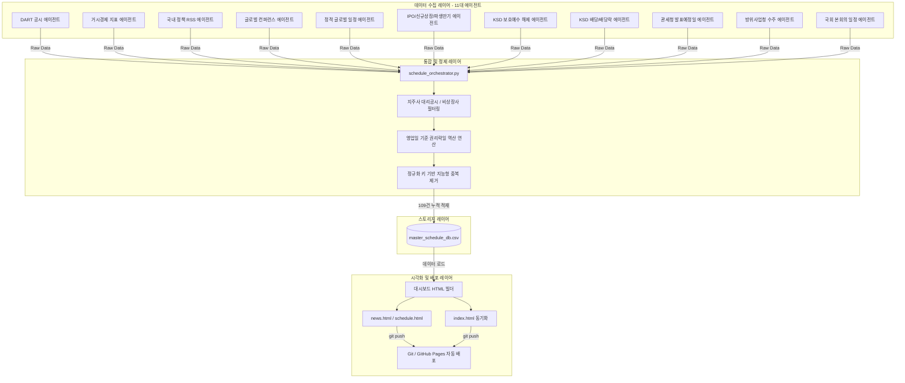

# 퀀트 투자일정 대시보드 시스템 아키텍처 및 파이프라인 요약

본 문서는 **Daily Stock News & Schedule System**의 일정 수집 파이프라인, 데이터 정제 필터링 규칙, 중복 제거 알고리즘, 그리고 실시간 대시보드 생성 및 배포에 이르는 전체 데이터 라이프사이클과 시스템 아키텍처를 요약합니다.

---

## 1. 시스템 개념 아키텍처

---

## 2. 데이터 수집 파이프라인 (11대 에이전트)

| 순번 | 에이전트 명칭 | 데이터 소스 (API / RSS) | 주요 수집 데이터 및 규격 |
|:---:|---|---|---|
| **1** | `dart_agent` | Open DART API | 유/무상증자, 회사합병 등 상장사 핵심 미래 공시 일정 (신주배정기준일, 합병기일, 신주상장예정일 등 본문 파싱) |
| **2** | `macro_agent` | Financial Modeling Prep | 미국 FOMC 금리 결정, 미국 소비자물가지수(CPI) 발표 등 거시 지표 발표 일정 |
| **3** | `rss_policy_agent` | 과기부, 금융위 등 7대 부처 RSS | 정부 핵심 IT/금융/산업 보도계획 및 입법 정책 관련 미래 일정 |
| **4** | `rss_global_agent` | Google Alerts RSS | 글로벌 메이저 컨퍼런스, 학회, 전시회 개최 일정 (CES, MWC, ASCO 등) |
| **5** | `static_calendar` | 로컬 정적 데이터베이스 | 역사적으로 고정된 미국 대선, 옵션만기 등 예측 가능한 정적 이벤트 |
| **6** | `stock_market_agent` | 38커뮤니케이션 / 거래소 | 코스닥/코스피 IPO 공모청약 일정, 신규상장 예정일, 옵션 만기일 |
| **7** | `lockup_agent` | 공공데이터포털 KSD API | 향후 30일 이내의 **의무보호예수 반환/해제 일자** 및 반환 주식수 |
| **8** | `ksd_corporate_agent` | 공공데이터포털 KSD API | 기업별 배당락일 및 주당 배당금 지급일정 (DART와의 중복 제거를 위해 증자 제외) |
| **9** | `customs_agent` | 규칙 기반 연산 모듈 | 매월 1일, 11일, 21일에 있는 **관세청 수출입 동향 발표일** (주말/공휴일 시 다음 영업일 자동 순연 계산) |
| **10** | `dapa_agent` | 공공데이터포털 방사청 API | 한화에어로스페이스, LIG넥스원 등 K-방산 핵심 상장사의 계약 수주 체결 정보 |
| **11** | `assembly_agent` | 국회 열린데이터포털 API | 제22대 국회 본회의 개최일정 및 회기 정보 (비로그인 공용 무제한 호출 규격) |

---

## 3. 핵심 비즈니스 로직 및 정제 규칙

### A. 투자 노이즈 필터링 및 상장사 제한 룰
* **상장 시장 한정**: DART 수집 시 법인구분 `corp_cls` 필드를 검사하여 `Y`(유가증권/KOSPI) 및 `K`(코스닥/KOSDAQ) 시장에 상장된 정상 기업의 공시만 남기고 비상장사 및 KONEX 공시는 원천 차단합니다.
* **지주사 대리 공시 차단**: 지주회사(모회사)가 비상장 자회사의 소식을 대리 공시하는 노이즈를 제거하기 위해, 공시 제목에 `(자회사의 주요경영사항)` 혹은 `(종속회사의 주요경영사항)`이 포함된 공문은 수집 단계 및 DB 저장 필터링에서 일괄 소거합니다. (예: KB금융의 KB증권 대리 공시 차단 완료)
* **불필요한 보고서 제외**: 제목에 `증권발행실적보고서` 등이 들어간 사후 보고용 공시는 투자 캘린더의 가독성을 저해하므로 제외 처리합니다.

### B. 신주배정일 기준 권리락일(Ex-rights) 역산 계산
* DART 에이전트가 공시 본문에서 `신주배정기준일`을 성공적으로 추출하면, 파이썬 날짜 연산 헬퍼 함수가 작동하여 **영업일 기준 1일 전 날짜**를 자동 역산합니다.
* 역산된 날짜로 `[권리락] {기업명} 유/무상증자 권리락` 일정을 생성해 대시보드에 세트로 함께 주입합니다. (주말을 완벽히 비껴가도록 토/일요일 회피 로직 탑재)

### C. 지능형 중복 제거 (Deduplication) 및 DB 누적
* 각 에이전트에서 긁어온 데이터는 `[날짜 + 정규화된 이벤트명]`의 조합으로 고유 정규화 키(`get_norm_key`)를 생성합니다.
* 동일 날짜에 발생한 유사한 명칭의 스케줄은 정규화 비교를 통해 하나로 자동 병합 처리되며, 마스터 CSV 데이터베이스(`master_schedule_db.csv`)에 갱신 시간과 함께 영구히 보존됩니다.

---

## 4. 대시보드 프레젠테이션 & UI 스타일

수집 완료된 일정들은 날짜별 차이(오늘 기준 D-Day)를 연산하여 **향후 60일 이내의 미래 일정만 필터링**하여 대시보드에 표출됩니다.

### 🎨 카테고리별 시인성 강화 배지 스타일
최종 웹 대시보드(`schedule.html` 및 메인 대시보드 `index.html`)상에서 투자 일정의 중요도를 시각적으로 분별할 수 있게 뱃지 스타일을 고도화했습니다:

* 🔴 **`badge-danger` (레드 경고 뱃지)**: 오버행 급락 리스크를 유발하는 **`의무보호예수 해제`** 일정 전용.
* 🟡 **`badge-warning` (골드 옐로 뱃지)**: 권리 관계 변동 및 현금 유입과 관련된 **`배당 / 권리락`** 일정 전용.
* 🔵 **`badge-info` (스카이 블루 뱃지)**: 정책 변동 및 시장 공시를 뜻하는 **`DART공시 / 정부정책 / 국회일정`** 전용.
* 🟢 **`badge-success` (에메랄드 그린 뱃지)**: 기업 수주 모멘텀 및 거시 발표를 뜻하는 **`방사청 수주 / 관세청 발표일`** 전용.
* 🟣 **`badge-custom` (보라 그라데이션 뱃지)**: 공모청약, 신규상장, 옵션만기 등 일반 증시 이벤트 전용.

---

## 5. 자동 배포 파이프라인 (CI/CD)

1. 스케줄러가 오케스트레이터(`schedule_orchestrator.py`)를 주기적으로 구동시킵니다.
2. 수집 $\rightarrow$ 정제 $\rightarrow$ 중복제거를 거쳐 `master_schedule_db.csv`에 적재합니다.
3. 갱신된 데이터를 바탕으로 `schedule.html` 및 `index.html` 의 정적 캘린더 영역을 실시간 다시 빌드합니다.
4. 빌드 완료 즉시 내부 Git 모듈이 작동하여 자동으로 원격 깃허브 저장소(`adkanbot.git`)에 커밋 및 푸시하여 **GitHub Pages를 통해 웹 사이트를 무중단 갱신**합니다.
