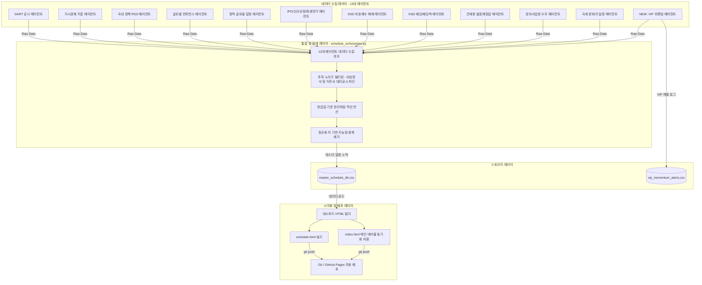

# 퀀트 투자일정 시스템 및 VIP 모멘텀 에이전트 개발 과정/프로세스 정리

본 문서는 **Daily Stock News & Schedule System**의 핵심 파이프라인인 **오케스트레이터(`schedule_orchestrator.py`)**의 전체 수집·배포 흐름과, 주말에 신규 추가된 **VIP 모멘텀 에이전트(`vip_momentum_agent.py`)**의 개발 과정 및 통합 아키텍처를 요약합니다.

---

## 1. 시스템 전체 개념 아키텍처 (Orchestration & Agents)

일정 파이프라인은 11대 기본 일정 수집 에이전트와 신규 VIP 모멘텀 에이전트가 오케스트레이터를 통해 하나로 융합되어 최종 웹 대시보드에 배포되는 구조를 가집니다.



---

## 2. 오케스트레이터 전체 실행 프로세스 (`schedule_orchestrator.py`)

오케스트레이터는 매일 아침 또는 주기적인 스케줄러(Cron)에 의해 실행되며 아래의 **4단계 라이프사이클**을 자동으로 완수합니다.

### 1단계: 에이전트 통합 수집 (Collection)
* 파이썬의 `sys.path`에 `agents/` 디렉토리를 바인딩한 후, 개별 에이전트 모듈로부터 일정 목록을 호출하여 하나의 `all_schedules` 리스트로 병합합니다.
* 예: `dart_agent.get_dart_schedules()`, `macro_agent.get_macro_schedules()`, `lockup_agent.get_ksd_lockup_release()` 등 순차 실행.

### 2단계: 데이터 병합 및 중복 제거 (Merge & Deduplication)
* **신규/기존 데이터 병합**: 기존의 [master_schedule_db.csv](file:///Users/adkan/adkan%EC%97%B0%EA%B5%AC2/schedule%20check/master_schedule_db.csv)를 로드하여 수집된 신규 DataFrame과 결합합니다.
* **정규화 키 비교 제거**: 동일 날짜에 발생한 미세하게 다른 이벤트 명칭(예: "공시접수", "(정정)" 등의 수식어 포함)을 걸러내기 위해 텍스트에서 특수기호/공백/지정 단어를 소거한 `dedup_key`를 계산하고 중복 행을 제거(`keep='last'`)합니다.
* **투자 가독성 저해 노이즈 필터링**: 
  * `증권발행실적보고서` 등의 사후 단순 보고성 공시 행 강제 제거.
  * `자회사의 주요경영사항` 등의 지주사(모회사) 대리 공시 정보 소거 (예: KB금융의 KB증권 대리 공시 원천 필터링).

### 3단계: 대시보드 HTML 동적 생성 (HTML Generation & Sync)
* **미래 일정 필터링**: 오늘 날짜를 기준으로 과거 일정은 화면에서 숨기고, **향후 60일 이내의 다가올 일정**만 필터링합니다.
* **3분할 테이블 생성**: 
  1. `공모청약 / 신규상장 / 파생만기`
  2. `국내 기업 공시 / 권리락 / 보호예수`
  3. `정책 / 매크로 / 수주 발표`
* **메인 대시보드 동기화**: 단독 캘린더 페이지인 `schedule.html`을 생성하는 동시에, 메인 홈화면인 [index.html](file:///Users/adkan/adkan%EC%97%B0%EA%B5%AC2/index.html) 내부의 주석 블록(`<!-- IPO_ROWS_START -->` 등)을 정규식으로 탐색하여 일정 리스트를 동기화하여 교체 치환합니다.

### 4단계: 깃허브 Pages 무중단 배포 (Git Automation)
* `subprocess` 모듈을 통해 로컬에서 `git add`, `git commit`을 연속 가동합니다.
* 변경된 마스터 DB와 HTML 결과물들을 원격 저장소(`adkanbot.git`)에 `push` 함으로써 **GitHub Pages를 통해 전 세계 어디서든 모바일로 일정을 확인**할 수 있도록 무중단 웹 배포를 실행합니다.

---

## 3. VIP 모멘텀 에이전트 (`vip_momentum_agent.py`) 프로세스 상세

글로벌 거물(CEO, 정상 등)의 돌발 일정을 실시간 감지하여 투자 모멘텀을 미리 발굴하는 특화 에이전트입니다.

### A. 수집 채널 및 필터
* **수집 채널**: 네이버 뉴스 API (실시간 키워드 검색 15건) + 구글 알리미 RSS 피드 2종.
* **사전 필터링**: 15일 이내 기사인지 판별하고, `방한`, `회동`, `독대`, `국빈`, `정상회담` 등 방문 중심의 `VIP_KEYWORDS`와 일치하는 기사만 남깁니다.
* **중복 제거**: 기존 수집 링크 DB인 `vip_momentum_alerts.csv`를 대조하여 중복 수집을 방어합니다.

### B. 로컬 LLM을 통한 4개 정보 추출
OpenAI 호환 API를 포팅하여 로컬 Ollama(`gemma4:e4b`)로 4대 모멘텀 속성을 강제 분석합니다.
1. **예상시기**: 일정이 발생하는 정확한 기간 추정.
2. **핵심이슈**: VIP 방문 목적 및 회동 행위 요약.
3. **관련섹터**: 15대 표준 투자 카테고리 매핑.
4. **추정수혜주**: 일정과 직접적으로 연관되는 국내 핵심 상장 수혜 기업 2~3개 추출.

---

## 4. VIP 에이전트의 오케스트레이터 연동 가이드 (Integration)

현재 VIP 에이전트는 단독 파일로 실행되어 [vip_momentum_alerts.csv](file:///Users/adkan/adkan%EC%97%B0%EA%B5%AC2/schedule%20check/vip_momentum_alerts.csv)에 로깅을 남기고 있습니다. 이를 오케스트레이터의 전체 일정 흐름에 녹여내어 웹 대시보드 캘린더에 노출하고 싶다면 아래와 같이 2단계를 진행합니다.

### 1단계: `vip_momentum_agent.py` 수정
수집한 모멘텀 알림 리스트를 오케스트레이터에 표준 규격 리스트로 반환하는 헬퍼 함수를 추가 정의합니다.
```python
# vip_momentum_agent.py 하단에 추가
def get_vip_momentum_schedules() -> list[dict]:
    """오케스트레이터 연동용: 수집 완료된 csv 파일에서 향후 예정된 일정을 마스터 DB용 규격으로 변환"""
    schedules = []
    if os.path.exists(OUTPUT_CSV):
        try:
            df = pd.read_csv(OUTPUT_CSV)
            for _, row in df.iterrows():
                # LLM이 분석한 예상시기(예: 2026-07-15 형식)를 파싱하여 date 필드로 매핑
                # 만약 날짜 형식이 아니면 수집된 날짜(date_captured)나 적절한 예정일을 지정
                schedules.append({
                    "date": row.get("estimated_timeline", row["date_captured"]),
                    "category": "VIP 일정",
                    "event": f"[{row['sector']}] {row['issue']} (수혜주: {row['target_stocks']})",
                    "source": row.get("source", "VIP레이더")
                })
        except Exception as e:
            print(f"⚠️ VIP CSV 읽기 실패: {e}")
    return schedules
```

### 2단계: `schedule_orchestrator.py` 수정
오케스트레이터 실행 목록에 추가 등록하고 병합시킵니다.
```python
# schedule_orchestrator.py 상단 임포트 영역
from vip_momentum_agent import get_vip_momentum_schedules

# schedule_orchestrator.py - run_schedule_pipeline() 함수 내부
    ...
    print("📥 11. 국회 본회의 일정 수집 중...")
    all_schedules.extend(get_assembly_meetings())
    
    print("📥 12. VIP 돌발 일정 및 모멘텀 수집 중...")
    all_schedules.extend(get_vip_momentum_schedules())  # 리스트에 추가
    ...
```

이 연동이 완료되면, VIP 모멘텀 에이전트가 로컬에서 누적한 고급 수혜주 정보가 대시보드 캘린더(HTML 및 index.html)에 자동으로 노출되며 GitHub Pages로 배포가 시작됩니다.
