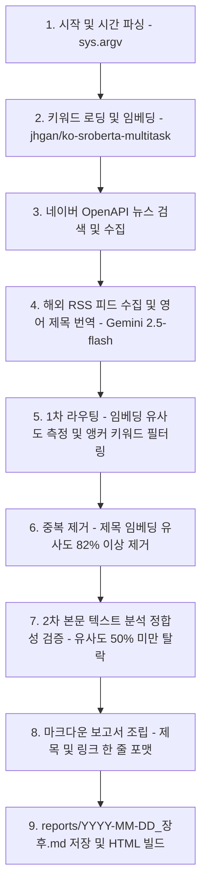

# 데일리뉴스(장후).py 코드 분석 및 동작 메커니즘 보고서

이 보고서는 여러 단계의 기능 보강 및 요약본 간소화(제목+링크 온리 포맷 적용) 단계를 거친 `데일리뉴스(장후).py` 스크립트의 현재 동작 매커니즘과 불필요한 레거시 코드를 정리한 가이드라인입니다.

---

## 1. 전체 파이프라인 동작 흐름 (Data Flow)

스크립트가 실행되어 최종 마크다운 리포트가 저장되기까지의 핵심 로직 흐름은 다음과 같습니다.

### 각 단계별 상세 설명

1. **시간 범위 파싱 (`parse_time_arguments`)**:
   * 실행 인자(`sys.argv`)가 없으면 기본값으로 당일 15:30 ~ 21:30 범위로 세팅합니다.
   * 날짜 인자가 있으면(예: `2026-06-26`) 해당 날짜의 08:00 ~ 17:00 범위를 설정하여 데이터를 수집합니다.
2. **키워드 임베딩 초기화 (`load_and_embed_keywords`)**:
   * `키워드3.json`에 정의된 섹터별 키워드를 불러와 로컬 임베딩 모델(`jhgan/ko-sroberta-multitask`)을 사용해 벡터화합니다.
3. **네이버 뉴스 검색 (`get_naver_news`)**:
   * 추출한 세부 키워드로 네이버 뉴스 검색 API를 호출하여 설정 시간 내의 뉴스를 페이지네이션(최대 100건) 수집합니다.
4. **해외 뉴스 수집 및 번역 (`collect_foreign_rss` & `translate_foreign_titles_gemini`)**:
   * 해외 주요 RSS 피드(블룸버그, 로이터 등)에서 뉴스를 수집한 후, 영문 제목을 Gemini API를 통해 금융/주식 시황 용어에 맞춰 한글로 번역합니다.
5. **1차 라우팅 및 보정 (`route_news_by_similarity` & `check_and_adjust_sector`)**:
   * 뉴스 제목과 간략 본문을 임베딩하여 가장 연관성이 높은 섹터로 1차 분류합니다.
   * 제목 분석 규칙 및 앵커 키워드 존재 여부를 체크하여 오분류 기사를 바로잡거나 연관성이 없는 기사는 '기타' 섹션으로 이동시킵니다.
6. **섹터별 중복 제거 (`deduplicate_routed_news`)**:
   * 동일 섹터 내에서 제목 간 유사도가 `0.82` 이상으로 겹치는 유사 중복 기사를 제거합니다.
7. **2차 정합성 최종 검증 및 조립 (`generate_summary_with_gemini`)**:
   * 2차 임베딩 검증을 거쳐 최종 스코어가 `0.50`을 넘는 기사만 섹터별 최상위 5건으로 압축합니다.
   * 요약을 제외한 **`* [{제목}]({링크})`** 형태의 정갈한 리스트로 마크다운을 결합해 최종 파일을 생성합니다.

---

## 2. 식별된 레거시 (더미) 코드 현황

뉴스 요약을 제거하고 제목 링크만 제공하기로 정책을 전환함에 따라, **작동하지만 실제 리포트 생성에는 기여하지 않는 불필요한 코드 조각**들이 대량으로 존재하고 있습니다.

| 일련번호 | 함수명 / 로직 | 코드 위치 (라인) | 불필요해진 사유 |
| :--- | :--- | :--- | :--- |
| **1** | `fetch_og_description` | 347 ~ 373 | 기사의 본문 내용을 크롤링하여 긁어오는 코드로, 본문 요약 노출이 제외됨에 따라 무의미해짐. |
| **2** | `is_complete_sentence` | 375 ~ 410 | 문장 종결 어미가 완성되었는지 판별하는 정제용 헬퍼이나, 더 이상 사용되지 않음. |
| **3** | `split_into_sentences` | 412 ~ 439 | 본문에서 마침표 기준으로 문장을 정밀 분리해 내던 함수로, 불필요해짐. |
| **4** | `generate_desc_with_gemini_batch` | 441 ~ 499 | og:description이 없을 때 Gemini API를 호출하여 요약을 받던 함수로, API 비용 및 쿼터 소모 요인이나 더 이상 무쓸모. |
| **5** | `update_news_descriptions` | 501 ~ 562 | 크롤링 및 Gemini batch 요약 프로세스를 제어하던 컨트롤러 함수로, 현재 주석 처리됨. |
| **6** | 중복 `return` | 1018 ~ 1019 | `generate_summary_with_gemini` 함수 끝자리에 완전히 동일한 return 구문이 2번 반복 적혀 있음. |

---

## 3. 리팩토링 권장 사항 및 기대 효과

* **가독성 향상**: 약 215라인 분량의 레거시 코드를 제거하면 파일 크기가 약 59KB에서 48KB 이하로 압축되며, 유지보수가 매우 명료해집니다.
* **불필요한 패키지 임포트 제거**: 본문 긁어오기에 활용되던 일부 라이브러리 참조 구문을 정리할 수 있습니다.
* **디버그 로그 단순화**: 실행 시 크롤링 접속 관련 터미널 출력량이 현격히 줄어들어 수집 성공/실패 여부를 모니터링하기 훨씬 수월해집니다.
